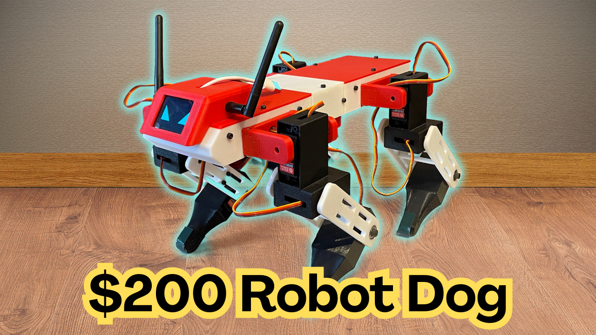

# Quattro ZBD – Android Control App

Android remote control for the Quattro ZBD quadruped robot. It talks to the robot's ESP32 over Wi-Fi (UDP): virtual joysticks and buttons go out, battery / IMU / mode telemetry comes back. It can also use a phone-as-puppet mode, where the robot mirrors the tilt of your phone.

Firmware repository: https://github.com/serdarselimys/QuattroZBD-AndroidControllerApp

---

## Features

- Two virtual joysticks: **Move** (forward/back + strafe) and **Spin** (turn on the spot)
- On-screen **L1 / R1 / L2 / R2 / A / B** buttons, mapped like a gamepad
- Live telemetry: robot state, battery % and voltage, accelerometer, balance and gait (TROT / WALK)
- **Emote mode** screen: pick and play emotes (the robot owns the list; the app mirrors the robot's own menu buttons)
- **Puppet mode**: the robot copies your phone's roll, pitch and yaw rate; **ZERO** sets the way you are holding the phone as neutral
- **Recall** button to re-run the robot's IMU auto-calibration (standing only)
- Physical gamepad buttons plugged into / paired with the phone (A, B, L1, R1, L2, R2 and sticks) also work
- Screen stays on while the app is open; puppet mode switches off automatically if the app goes to the background

---

## Connecting to the robot

1. Power the robot. The ESP32 creates its own Wi-Fi network:

   | Setting | Value |
   |---|---|
   | SSID | `QUADRUPED_ESP32` |
   | Password | `12345678` (default, change it in the firmware) |
   | Robot IP | `192.168.4.1` |
   | UDP port | `5000` |

2. On the phone go to **Wi-Fi settings** and join `QUADRUPED_ESP32` manually. The app does not do this for you.
3. If Android says the network has no internet and offers to switch to mobile data, **stay on the robot's network**.
4. Open the app. When telemetry appears (battery, state) the link is working.

---

## Controls

| Control | Action |
|---|---|
| **Move** joystick | Walk forward/back and strafe |
| **Spin** joystick | Turn on the spot |
| **L1 / R1** | Body height down / up (hold both for 2 s = stand / sit) |
| **L2 / R2** | Pitch trim nose down / up |
| **A** | Body leveling on/off |
| **B** | Gait toggle: trot ↔ walk |
| **EMOTE** | Enter / leave emote mode |
| **RECALL** | Re-run IMU auto-calibration (standing only) |
| **PUPPET** | Phone-tilt control on/off (hold the phone upright, top = nose) |
| **ZERO** | In puppet mode, take the current phone attitude as neutral |

**Emote mode screen:** L1 / R1 move the selection on the robot, **A** plays, **B** exits. These are the same four buttons as the robot's own screen menu.

**Menus on the robot's screen:** while the robot is sitting, L1/R1 = up/down, L2/R2 = left/right, A = open/save, B = back/cancel.

---

## Telemetry shown

| Item | Notes |
|---|---|
| State | SLEEP, ACTIVE, BODY LEVELING, PUPPET, CALIBRATION, EMOTE MODE |
| Accelerometer | X / Y / Z in m/s² |
| Balance / gait | Balance ON/OFF and TROT/WALK |
| Joint / offset | Used while editing servo offsets from the robot menu |

---

## Protocol (for developers)

All values little-endian, over UDP to `192.168.4.1:5000`, about every 8 ms.

**App → robot (61 bytes)**

| Bytes | Content |
|---|---|
| 0–3, 4–7, 8–11 | joystick forward, side, spin (float) |
| 12–15, 16–19 | left / right trigger values (float) |
| 20 | buttons 1: bit0 A, bit1 B, bit2 L1, bit3 R1, bit4 emote toggle, bit5 emote play, bit6 emote stop |
| 21 | selected emote index |
| 22 | buttons 2: bit0 manual IMU calibration, bit6 L2, bit7 R2 |
| 23–47 | reserved (0) |
| 48 | puppet flags: bit0 puppet on, bit1 re-zero |
| 49–60 | phone roll (deg), pitch (deg), gyro Z (deg/s) as floats |

**Robot → app (28 bytes)**

| Bytes | Content |
|---|---|
| 0–11 | accelerometer X, Y, Z (float) |
| 12–15 | battery voltage (float) |
| 16–19 | selected joint ID (int) |
| 20–23 | joint offset (float) |
| 24 | display state (1 active, 2 calibration, 3 emote, otherwise sleep) |
| 25 | balance on |
| 26 | walk gait on |
| 27 | playing emote index |

The emote list:

Curious Head Tilt, Cautious Object Tap, The Wiggle, Play Bow, Happy Dance into Sneak, Breathing into Foot Stomp, Matrix Gyro Roll, Push-Ups, Sit & Wave Hello.

---

## Safety

The robot can fall and servos can pinch. Test on a stand first, keep the robot's emergency stop (SELECT/BACK on a gamepad) in mind, and keep the app in the foreground while driving. If no control packets arrive for about half a second, the firmware's stale-data failsafe takes over.

## Licensing & Commercial Use

Licensed under **Creative Commons Attribution–NonCommercial 4.0 International (CC BY-NC 4.0)**.

You are free to remix, adapt and build upon this design for non-commercial purposes, with appropriate credit. Commercial use of any kind is not permitted.

https://creativecommons.org/licenses/by-nc/4.0/
